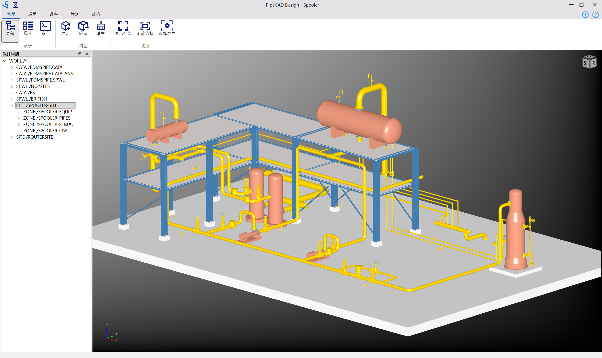
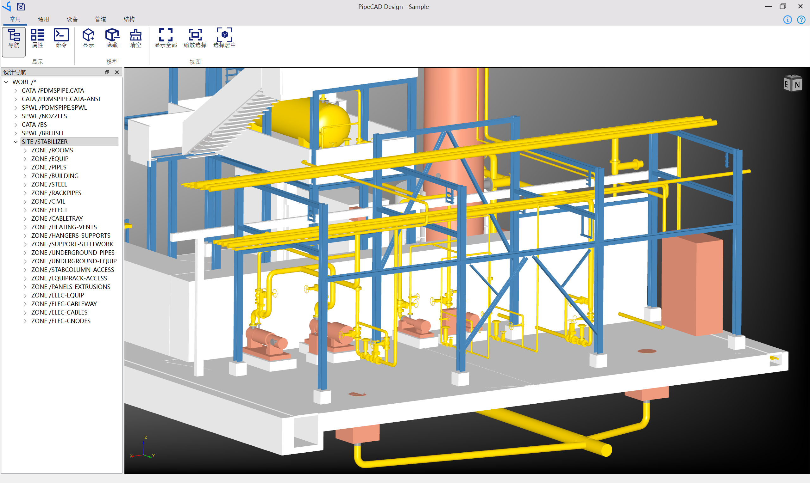
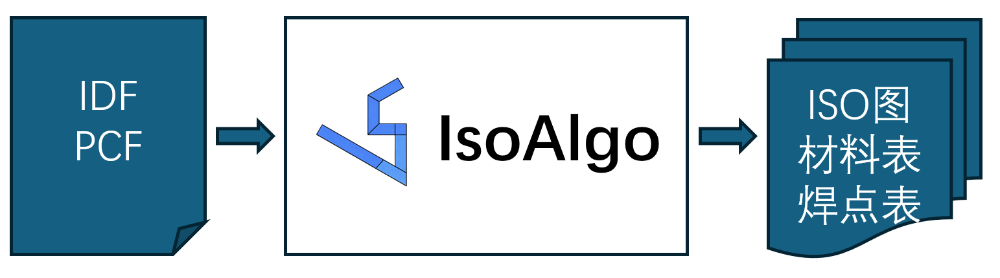
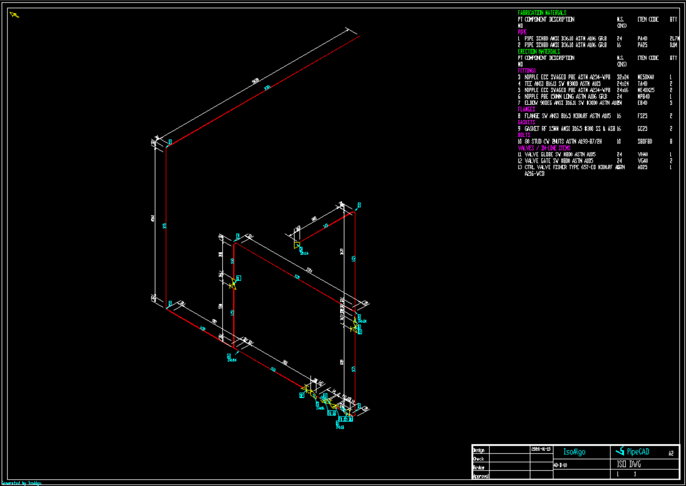
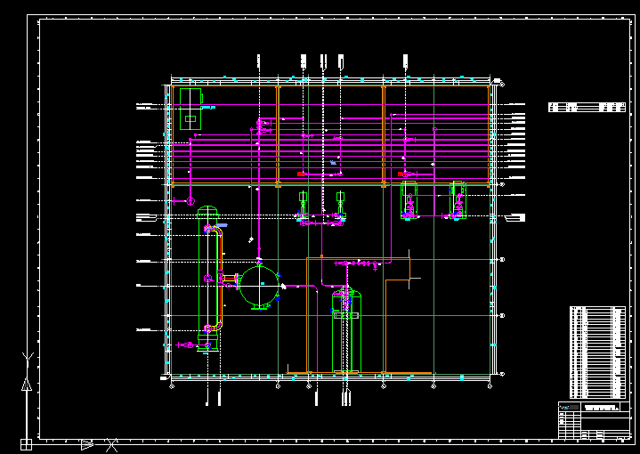
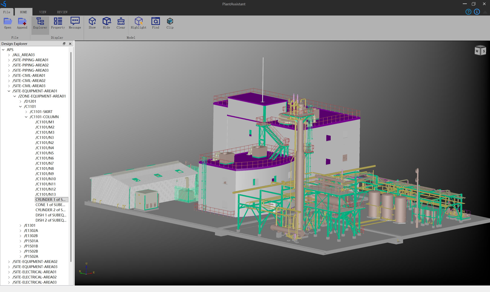
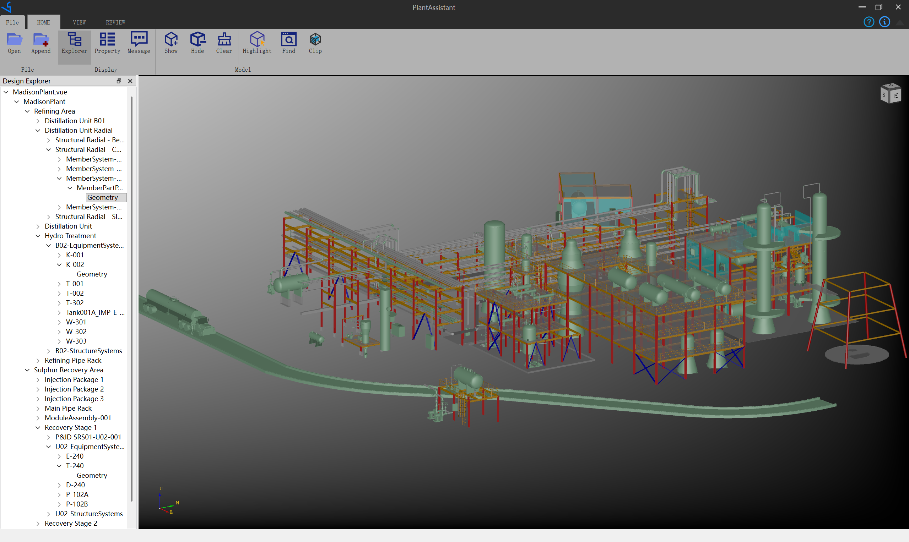

# WHTUHE

Wuhan TUHE Tech Co., Ltd. is an industrial software company. Welcome to our GitHub repository.

## PipeCAD - Plant Piping Design Software.

Spooler project:

Stabilizer project:

## IsoAlgo - Piping Isometric drawing generation algorithm.

## AutoDraft - Automatic drawing generation for Plant.

## PlantAssistant - Review plant model files.

